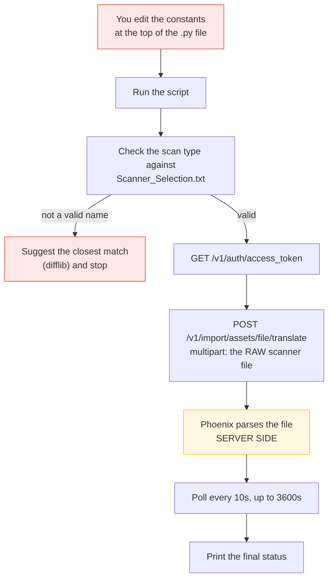
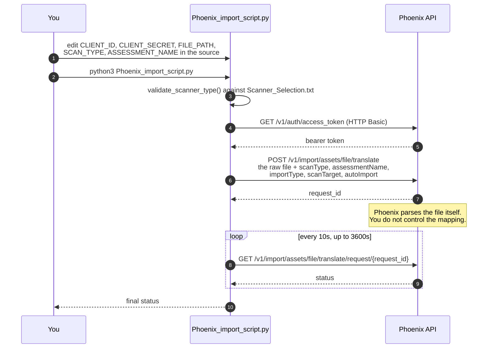
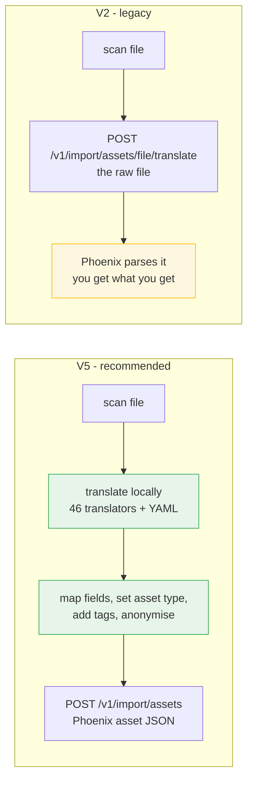
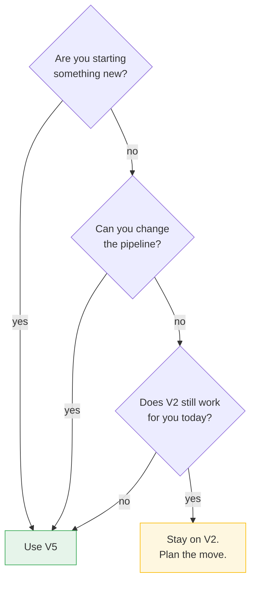

# Phoenix Loading Script V2 — Legacy

[](CHANGELOG.md)
[](CHANGELOG.md)

| | |
|---|---|
| **Version** | `2.0.0` — see [`VERSION`](VERSION) |
| **Changelog** | [`CHANGELOG.md`](CHANGELOG.md) |
| **Status** | Maintenance only. Security and compatibility fixes only. |
| **Successor** | `../Loading_Script_V5` — use this for new work |
| **Public mirror** | `LEGACY_Loading_Script_V2_PUB` in the public Loading-Script repo |
| **Release tag** | `loading-v2-v2.0.0` |

> **Before you change anything in this folder:** add a `CHANGELOG.md` entry and bump
> `VERSION`. The publish tool refuses to ship this bundle otherwise. See
> `CLAUDE.md`.

## Should I use V2 or V5?

| Use V2 when | Use V5 when |
|---|---|
| An existing pipeline already pins these scripts | Anything new |
| You need the small single-purpose importers | You need 40+ scanner translators |
| You cannot change the pipeline right now | You need CI metadata tagging, batching, retries |

V5 supports every scanner V2 supports. Migrating is the recommended path.

## How it works

V2 does **no translation**. It uploads the scanner's raw file to Phoenix and lets the
**server** parse it. That single design choice explains every limitation below.



### The API calls, in order



### V5 and V2 side by side



## Why V2 is not recommended

| # | Problem in V2 | What V5 does instead |
|---|---|---|
| 1 | **Credentials sit in the source file.** `CLIENT_ID` and `CLIENT_SECRET` are constants at the top of each `.py`. One careless commit publishes them. | Reads `config.ini`, which is git-ignored, or environment variables. |
| 2 | **You cannot control the mapping.** Phoenix parses the file server side. If a field lands in the wrong place, you have no lever. | Parses locally. You can change the mapping in `scanner_field_mappings.yaml` or write a translator. |
| 3 | **One script per scanner.** Seven scripts, each edited by hand. No detection. | One command. `--scanner auto` recognises the format. |
| 4 | **Roughly 7 scanners.** | 200+ scanner types. |
| 5 | **No batching.** A large file is one request. Big scans time out. | Splits large imports into batches with retries. |
| 6 | **No asset type control.** | `--asset-type INFRA \| WEB \| CLOUD \| CONTAINER \| REPOSITORY \| CODE \| BUILD` |
| 7 | **No tagging.** You cannot attach CI metadata to an asset. | `--tag-file` attaches build, branch, commit and pipeline tags. |
| 8 | **No anonymisation.** Real hostnames and IPs go to the API as they are. | `--anonymize` replaces them first. |
| 9 | **No verification and no error report.** You get a status string. | `--verify-import` reads the data back; `--error-log` writes a JSON failure report. |
| 10 | **Configuration is code.** Changing the file path means editing Python. | Command-line flags and a config file. |

### Should you migrate?



V5 supports every scanner V2 supports. See [`MIGRATION_GUIDE.md`](MIGRATION_GUIDE.md).

The move, in short:

```bash
# V2
# 1. edit CLIENT_ID, CLIENT_SECRET, FILE_PATH, SCAN_TYPE in Phoenix_import_script.py
# 2. python3 Phoenix_import_script.py

# V5 - the same import
python3 phoenix_multi_scanner_import.py \
  --config config_multi_scanner.ini \
  --file scans/sonarqube.json \
  --scanner sonarqube \
  --assessment "OWASP Benchmark"
```

## Files in this bundle

| Script | Purpose |
|--------|---------|
| `Phoenix_import_script.py` | Single-file import, with scanner-type validation |
| `phoenix_multi_import.py` | Multi-file / multi-scanner import driver |
| `aqua_import2-1.py`, `aqua_import2-2.py` | Aqua Security scan import |
| `snyk_import.py`, `snyk_import2.py` | Snyk scan import |
| `sonarqube_import_pipeline.py` | SonarQube import from a CI pipeline |
| `sonarqube_import2 simple_file_v2 copy.py` | SonarQube import from a local file |
| `thrivi_Scan.py` | Trivy scan import |
| `Scanner_Selection.txt` | Valid scanner-type names accepted by the API |
| `config.ini.example` | Credential template — copy to `config.ini`, never commit `config.ini` |

## Credentials

Never hardcode credentials. Copy `config.ini.example` to `config.ini` and fill it in,
or export the values as environment variables. `config.ini` is git-ignored.

---

## Original documentation

Utilities and script to simplify the upload of phoenix config

# Phoenix Import Script

A Python script for importing SonarQube scan results into the Phoenix Security platform. This script automates the process of uploading scan results, validating scanner types, and monitoring the import process.

## Features

- Upload Scanner scan results to Phoenix Security
- Validate scanner types against a predefined list
- Suggest closest matching scanner type if an invalid type is provided
- Monitor import status with configurable polling intervals
- Support for both automatic and manual import processes
- Configurable timeout for import completion

## Prerequisites

- Python 3.6+
- Required Python packages:
  - requests
  - difflib

## Installation

1. Clone this repository or download the script
2. Install the required dependencies:

```bash
pip install requests
```

## Configuration

The script uses several configuration parameters that can be modified at the top of the file:

```python
# API Configuration
CLIENT_ID = "your-client-id"
CLIENT_SECRET = "your-client-secret"
API_BASE_URL = "https://api.YOURDOMAIN.securityphoenix.com"
API_BASE_URL = "https://api.demo.appsecphx.io"


# Import Parameters
FILE_PATH = 'path-to-your-scan-file.json'
SCAN_TYPE = 'Scannerns' #check /Loading Script/Scanner_Selection.txt
ASSESSMENT_NAME = 'Your Assessment Name'
IMPORT_TYPE = 'new'  # or 'merge'
SCAN_TARGET = 'your-scan-target.com'
AUTO_IMPORT = True
WAIT_FOR_COMPLETION = True

# Scanner types file path
SCANNER_TYPES_FILE = 'path/to/Scanner_Selection.txt'
```

## Scanner Types Validation

The script validates scanner types against a predefined list stored in a text file. The file should contain one scanner type per line. If an invalid scanner type is provided, the script will suggest the closest matching type.

## Usage

### Basic Usage

```python
from sonarqube_import import send_results

request_id, final_status = send_results(
    FILE_PATH, 
    SCAN_TYPE, 
    ASSESSMENT_NAME, 
    IMPORT_TYPE, 
    CLIENT_ID, 
    CLIENT_SECRET, 
    SCAN_TARGET,
    AUTO_IMPORT,
    WAIT_FOR_COMPLETION
)
```

### Without Waiting for Completion

```python
request_id, response = send_results(
    FILE_PATH, 
    SCAN_TYPE, 
    ASSESSMENT_NAME, 
    IMPORT_TYPE, 
    CLIENT_ID, 
    CLIENT_SECRET, 
    SCAN_TARGET,
    AUTO_IMPORT,
    False  # Don't wait for completion
)

# Check status manually later
if request_id:
    status = check_import_status(request_id, CLIENT_ID, CLIENT_SECRET)
    print(f"Current status: {status.get('status')}")
```

## Functions

### `load_scanner_types(file_path)`

Loads valid scanner types from the specified file.

### `find_closest_scanner_type(scanner_type, valid_scanner_types)`

Finds the closest matching scanner type from the list of valid types.

### `validate_scanner_type(scanner_type)`

Validates if the provided scanner type is in the list of valid types and suggests the closest match if not.

### `get_access_token(client_id, client_secret)`

Obtains an access token for API authentication.

### `check_import_status(request_id, client_id, client_secret)`

Checks the status of an import request.

### `wait_for_import_completion(request_id, client_id, client_secret, check_interval=10, timeout=3600)`

Continuously checks the status of an import until it completes or times out.

### `send_results(file_path, scan_type, assessment_name, import_type, client_id, client_secret, scan_target=None, auto_import=True, wait_for_completion=True)`

Sends scan results to the API and optionally waits for the import to complete.

## Error Handling

The script includes error handling for:
- File not found errors when loading scanner types
- API authentication failures
- Import status check failures
- Import timeouts

## Security Considerations

- The script contains hardcoded client ID and client secret. In a production environment, these should be stored securely (e.g., environment variables or a secure vault).
- The script uses HTTPS for API communication.

## License

[Specify your license here]

## Contributing

[Specify contribution guidelines here]
