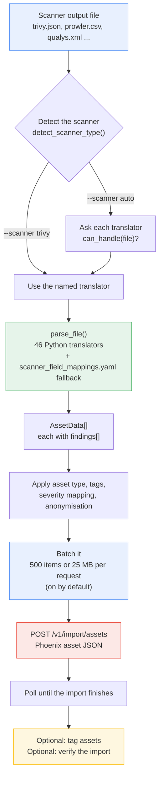
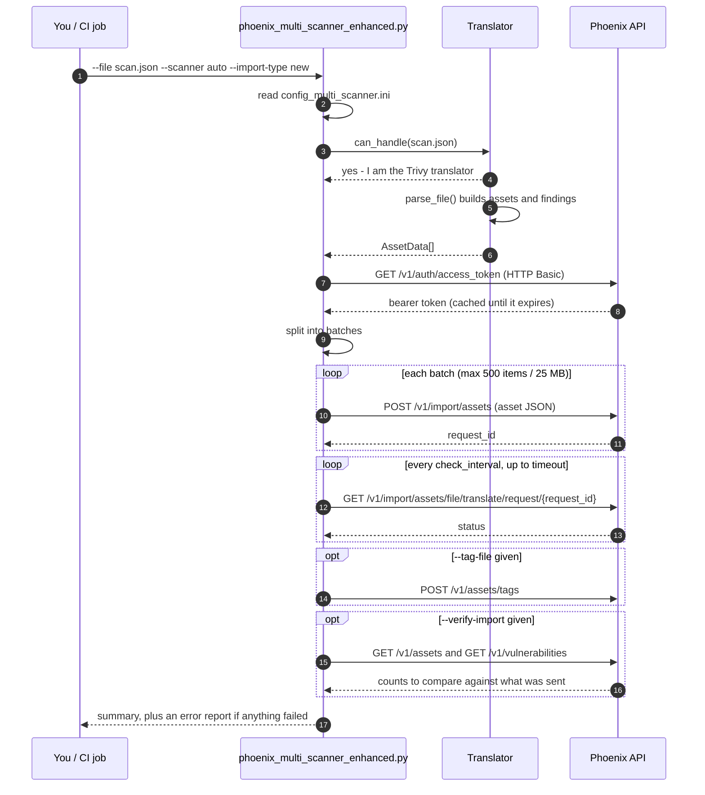
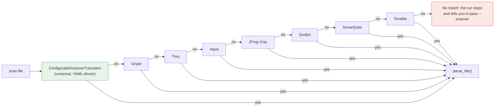
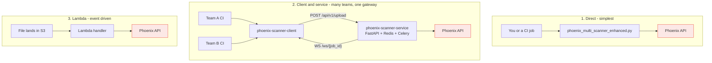

# Phoenix Multi-Scanner Import Tool (V5)

[](CHANGELOG.md)
[](CHANGELOG.md)

![Phoenix Security Loading Scripts. Scanners such as Trivy, Snyk, containers, IaC, secrets, Dependabot, AWS and SBOM produce JSON, SARIF, XML, CSV and SBOM files. The loading script ingests them, runs scanner detection and a modular translator, validates and batches, adds CI metadata, then uploads to the Phoenix platform, which emerges unified findings with asset, repository, application, environment, severity, scanner and CI metadata context. The pipeline reads scan, load, translate, normalize, enrich, Phoenix.](docs/assets/loading-script-overview.jpeg)

**Your scanners. One pipeline. One Phoenix.**

| | |
|---|---|
| **Version** | `5.0.0` — see [`VERSION`](VERSION) |
| **Changelog** | [`CHANGELOG.md`](CHANGELOG.md) |
| **Status** | Active. All new scanners and features land here. |
| **Predecessor** | `../Loading_Script_V2` — legacy, maintenance only |
| **Public mirror** | `Loading_Script_V5_PUB` in the public Loading-Script repo |
| **Release tag** | `loading-v5-v5.0.0` |

> **Before you change anything in this folder:** add a `CHANGELOG.md` entry and bump
> `VERSION`. The publish tool refuses to ship this bundle otherwise. See
> `CLAUDE.md`.

## Version numbering

`5.0.0` continues the series that ran to `3.4.0`. The jump realigns the version number
with the `Loading_Script_V5` folder name. It is a numbering change, not a rewrite —
`5.0.0` behaves exactly like the previous `3.4.0`.

## Releasing

```bash
cd Utils
# 1. Edit code. 2. Add a CHANGELOG.md entry. 3. Bump VERSION.
export UTILS_PUB_ROOT=/path/to/PUB-Loading-Script
python3 publish_utils_to_public_repo.py --bundle loading_script_v5_pub --dry-run
python3 publish_utils_to_public_repo.py --bundle loading_script_v5_pub --tag
```

Full instructions: `../UTILS_PUBLISH_TO_PUBLIC.md`.

---

## How it works

> **Which script do I run?** `phoenix_multi_scanner_enhanced.py`. That is the one
> this page documents. `phoenix_multi_scanner_import.py` is the older base tool: it
> works, but it has no batching, and its `--scanner` only accepts a short fixed list.

The V5 script does the translation **on your machine**. It reads the scanner's output file,
turns it into Phoenix asset and finding objects, and posts that JSON to the Phoenix API.



### The API calls, in order



### How a scanner gets recognised

`--scanner auto` is the default. The script asks each translator in turn whether it can
handle the file. The first one that says yes wins.



The universal translator is tried first. It is driven by `scanner_field_mappings.yaml`,
which is why the tool covers 200+ scanner types without 200 Python files. The named
translators after it handle formats that need real logic, not just field mapping.

If auto-detection picks the wrong one, name it: `--scanner trivy`.

### Three ways to run it



| Mode | Use it when | Credentials live |
|---|---|---|
| **Direct** | One team, one pipeline | In each pipeline |
| **Client + service** | Many teams; you want one place to hold credentials and watch jobs | Only in the service |
| **Lambda** | Scans arrive in S3 and should import themselves | In the Lambda environment |

Read [`CLIENT_SERVER_VS_DIRECT_UPLOAD_GUIDE.md`](docs/guides/CLIENT_SERVER_VS_DIRECT_UPLOAD_GUIDE.md)
before choosing.

### Import types

| `--import-type` | What Phoenix does |
|---|---|
| `new` | Creates a new assessment. Previous findings stay where they are. |
| `merge` | Adds to the existing assessment. Nothing is closed. |
| `delta` | Treats this scan as the full truth. Findings missing from it get closed. |

`delta` is the one that closes findings. Use it only when the scan really covers everything.

### Common runs

```bash
# One file, let the tool work out the scanner
python3 phoenix_multi_scanner_enhanced.py --config config_multi_scanner.ini \
  --file scans/trivy.json

# A whole folder, named scanner, merge into an existing assessment
python3 phoenix_multi_scanner_enhanced.py --config config_multi_scanner.ini \
  --folder scans/ --scanner trivy --import-type merge --assessment "Nightly build"

# Containers, with CI metadata tags, and check the result afterwards
python3 phoenix_multi_scanner_enhanced.py --config config_multi_scanner.ini \
  --file scans/grype.json --asset-type CONTAINER \
  --tag-file ci_tags.json --verify-import

# Strip hostnames and IPs before sending
python3 phoenix_multi_scanner_enhanced.py --config config_multi_scanner.ini \
  --file scans/nessus.xml --anonymize
```

| Flag | What it does |
|---|---|
| `--file` / `--folder` | One file, or every scan file in a folder. Pick one. |
| `--scanner` | `auto` (default), or any of the 203+ scanner names |
| `--asset-type` | `INFRA` `WEB` `CLOUD` `CONTAINER` `REPOSITORY` `CODE` `BUILD` |
| `--import-type` | `new` (default) `merge` `delta` |
| `--assessment` | Assessment name. Auto-generated if you leave it out. |
| `--tag-file` | JSON file of tags to attach to assets, for example CI metadata |
| `--anonymize` | Replace hostnames and IP addresses before sending |
| `--verify-import` | Read the assets back and compare the counts |
| `--error-log` | Write a JSON report of everything that failed |
| `--debug` | Save every request and response under `debug/` |
| `--max-batch-size` | Items per request. Default `500`. |
| `--max-payload-mb` | Size cap per request. Default `25.0`. |
| `--disable-batching` | Send one request instead. Only for small files. |
| `--asset-name` | Force one asset name instead of deriving it from the file |


---


**Version:** 4.0 (Hybrid Translation System) → **5.0 (Modular Architecture)** 🆕  
**Release Train:** 3.4.0 (Loading + CI Metadata Tagging)  
**Date:** May 2026  
**Status:** Production Ready ✅ | **Coverage:** 100% (205/205 Active Scanners)

A comprehensive vulnerability import tool for Phoenix Security that supports **205 scanner types** with a modular translator architecture (51 consolidated translators + YAML fallback), intelligent batching, data validation, and flexible import modes.

> 🎉 **NEW in v5.0:** Scanner translators refactored into clean `scanner_translators/` module with major consolidations (JFrog XRay 5→1, BlackDuck 5→1, Prowler 4→1, Wiz 2→1). See MIGRATION_SUMMARY.md and CHANGELOG_MIGRATION.md
>
> 🆕 **NEW in v3.4.0:** Direct CI/CD metadata tagging flow is fully documented and `--tag-file` is now loaded in runtime execution for `phoenix_multi_scanner_enhanced.py`.

---

## 📋 Table of Contents

- [Overview](#overview)
- [Key Features](#key-features)
- [Supported Scanners](#supported-scanners)
- [Understanding Assessments](#understanding-assessments)
- [Import Types Explained](#import-types-explained)
- [What’s New in v3.4.0](#whats-new-in-v340)
- [Quick Start](#quick-start)
- [Installation](#installation)
- [Configuration](#configuration)
- [Usage Examples](#usage-examples)
- [Asset Types](#asset-types)
- [Command Reference](#command-reference)
- [Architecture](#architecture)
- [Troubleshooting](#troubleshooting)
- [Documentation](#documentation)

---

## Overview

The Phoenix Multi-Scanner Import Tool (`phoenix_multi_scanner_enhanced.py`) is a production-grade Python application that imports vulnerability scan results from 203 different security scanners into the Phoenix Security platform.

### What It Does

- 🔍 **Auto-detects** scanner type from scan files (JSON, XML, CSV)
- 🔄 **Translates** scanner-specific formats to Phoenix Security standard format
- ✅ **Validates** and fixes data issues before import
- 📦 **Batches** large payloads intelligently to prevent API timeouts
- 🔁 **Retries** failed imports with exponential backoff
- 📊 **Tracks** progress and provides detailed logging

### What It Doesn't Do

- ❌ **Does NOT upload files** - it parses scanner output and POSTs JSON via API
- ❌ **Does NOT run scanners** - it only imports existing scan results
- ❌ **Does NOT modify original files** - read-only processing

---

## What's New in v3.4.0

### CI Metadata Generation for Direct Uploads

You can now standardize CI/CD context in imported assets by generating a YAML tag file and passing it with `--tag-file`.

Example metadata tags:

- `ci_provider`
- `ci_repo`
- `ci_branch`
- `ci_commit`
- `ci_run_id`
- `ci_job`
- `ci_actor`
- `ci_workflow`
- `ci_pipeline_url`

### Runtime Tag-File Support in Enhanced Script

`phoenix_multi_scanner_enhanced.py` now loads tag configuration at runtime when `--tag-file` is provided and propagates it through the enhanced importer path.

This keeps tag behavior consistent for both standard and batched imports.

---

## Key Features

### 🎯 Core Capabilities

- **205 Scanner Types Supported** - From Trivy to Grype to Nessus and beyond (100% coverage)
- **Modular Translation System** 🆕 - 56 consolidated translators in `scanner_translators/` module + YAML-based fallback
  - **4 Major Consolidations:** JFrog XRay (5→1), BlackDuck (5→1), Prowler (4→1), Wiz (2→1)
  - **Organized by Category:** Container (5), Build/SCA (11), Cloud (5), Code/Secret (5), Web (TBD), Infra (TBD)
- **Intelligent Batching** - Automatically splits large scans (max 500 assets/batch)
- **Data Validation** - Pre-import validation catches errors early with auto-fixing
- **Three Import Modes** - `new`, `merge`, `delta` for different scenarios
- **Seven Asset Types** - INFRA, WEB, CLOUD, CONTAINER, CODE, REPOSITORY, BUILD

### 🚀 Advanced Features

- **Retry Logic** - Exponential backoff for failed batches
- **Progress Tracking** - Real-time status updates for large imports
- **Error Recovery** - Individual batch failures don't stop entire import
- **Flexible Configuration** - Per-scanner settings via INI files
- **Comprehensive Logging** - Detailed logs for debugging and audit trails

---

## Supported Scanners

**Total:** 205 active scanner types across all security domains (100% coverage achieved)

The tool uses a **hybrid translation system**:
- **63 hard-coded translators** for complex/high-priority scanners (Trivy, Grype, JFrog, Prowler, etc.)
- **YAML-based fallback** for remaining scanners - no code changes needed to add new scanners!

### Complete Scanner List (Alphabetical)

<details>
<summary><b>Click to expand full list of 159+ supported scanners</b></summary>

| Scanner | Type | Description |
|---------|------|-------------|
| **Acunetix Scan** | WEB | Web application security scanner |
| **Acunetix360 Scan** | WEB | Enterprise web vulnerability scanner |
| **Anchore Engine Scan** | CONTAINER | Container security analysis |
| **Anchore Enterprise Policy Check** | CONTAINER | Enterprise container policy compliance |
| **Anchore Grype** | CONTAINER | Vulnerability scanner for container images |
| **AnchoreCTL Policies Report** | CONTAINER | Anchore policy evaluation reports |
| **AnchoreCTL Vuln Report** | CONTAINER | Anchore vulnerability reports |
| **AppSpider Scan** | WEB | Dynamic application security testing |
| **Aqua Scan** | CONTAINER | Container security platform |
| **Arachni Scan** | WEB | Web application security scanner |
| **AuditJS Scan** | BUILD | JavaScript dependency auditing |
| **AWS Prowler Scan** | CLOUD | AWS security best practices scanner |
| **AWS Prowler V3** | CLOUD | AWS Prowler v3/v4/v5 (OCSF format) ✅ |
| **AWS Scout2 Scan** | CLOUD | AWS security auditing tool |
| **AWS Security Finding Format (ASFF) Scan** | CLOUD | AWS standard security findings |
| **AWS Security Hub Scan** | CLOUD | AWS centralized security findings |
| **Azure Security Center Recommendations Scan** | CLOUD | Azure security posture management |
| **Bandit Scan** | CODE | Python security linter |
| **Blackduck Component Risk** | BUILD | Component risk analysis |
| **Blackduck Hub Scan** | BUILD | Open source security management |
| **Brakeman Scan** | CODE | Ruby on Rails security scanner |
| **BugCrowd Scan** | WEB | Crowdsourced security testing |
| **Bundler-Audit Scan** | BUILD | Ruby dependency security checker |
| **Burp Enterprise Scan** | WEB | Enterprise web security testing |
| **Burp GraphQL API** | WEB | GraphQL security testing |
| **Burp REST API** | WEB | REST API security testing |
| **Burp Scan** | WEB | Web application security testing |
| **CargoAudit Scan** | BUILD | Rust dependency security auditing |
| **Checkmarx OSA** | BUILD | Open source analysis |
| **Checkmarx Scan** | CODE | Static application security testing |
| **Checkmarx Scan detailed** | CODE | Detailed SAST results |
| **Checkov Scan** | CLOUD | Infrastructure as Code security |
| **Clair Klar Scan** | CONTAINER | Container vulnerability analysis |
| **Clair Scan** | CONTAINER | Static container vulnerability scanner |
| **Cloudsploit Scan** | CLOUD | Cloud security posture management |
| **Cobalt.io Scan** | WEB | Pentesting as a service |
| **Codechecker Report native** | CODE | Static analysis report format |
| **Contrast Scan** | CODE | Runtime application security |
| **Coverity API** | CODE | Static code analysis |
| **Crashtest Security JSON File** | WEB | Continuous web security testing |
| **Crashtest Security XML File** | WEB | Web security testing results |
| **CredScan Scan** | CODE | Credential leak detection |
| **CycloneDX Scan** | BUILD | Software Bill of Materials (SBOM) |
| **DawnScanner Scan** | CODE | Ruby security scanner |
| **Dependency Check Scan** | BUILD | OWASP dependency vulnerability checker |
| **Dependency Track Finding Packaging Format (FPF) Export** | BUILD | Dependency tracking format |
| **Detect-secrets Scan** | CODE | Secret detection in code |
| **docker-bench-security Scan** | CONTAINER | Docker security best practices |
| **Dockle Scan** | CONTAINER | Container image linter |
| **DrHeader JSON Importer** | WEB | HTTP security headers analyzer |
| **DSOP Scan** | CONTAINER | DoD container hardening |
| **Edgescan Scan** | WEB | Continuous security testing |
| **ESLint Scan** | CODE | JavaScript code quality and security |
| **Fortify Scan** | CODE | Application security testing |
| **Generic Findings Import** | BUILD | Generic vulnerability format |
| **Ggshield Scan** | CODE | GitGuardian secret scanning |
| **Github Vulnerability Scan** | BUILD | GitHub security advisories |
| **GitLab API Fuzzing Report Scan** | WEB | API security testing |
| **GitLab Container Scan** | CONTAINER | Container security scanning |
| **GitLab DAST Report** | WEB | Dynamic application security |
| **GitLab Dependency Scanning Report** | BUILD | Dependency vulnerability scanning |
| **GitLab SAST Report** | CODE | Static application security |
| **GitLab Secret Detection Report** | CODE | Secret leak detection |
| **Gitleaks Scan** | CODE | Git secret scanning |
| **Gosec Scanner** | CODE | Go security checker |
| **Govulncheck Scanner** | CODE | Go vulnerability checker |
| **HackerOne Cases** | WEB | Bug bounty platform results |
| **Hadolint Dockerfile check** | CONTAINER | Dockerfile linter |
| **Harbor Vulnerability Scan** | CONTAINER | Container registry scanning |
| **Horusec Scan** | CODE | Multi-language security analysis |
| **HuskyCI Report** | CODE | CI security orchestration |
| **Hydra Scan** | INFRA | Network authentication testing |
| **IBM AppScan DAST** | WEB | Dynamic application testing |
| **Immuniweb Scan** | WEB | Web security and compliance |
| **IntSights Report** | INFRA | External threat intelligence |
| **JFrog Xray API Summary Artifact Scan** | BUILD | Artifact vulnerability analysis |
| **JFrog Xray Scan** | BUILD | Universal artifact analysis |
| **JFrog Xray Unified Scan** | BUILD | Unified security scanning |
| **KICS Scan** | CLOUD | Infrastructure as Code security |
| **Kiuwan Scan** | CODE | Application security and quality |
| **kube-bench Scan** | CONTAINER | Kubernetes security benchmarking |
| **Meterian Scan** | BUILD | Automated dependency security |
| **Microfocus Webinspect Scan** | WEB | Enterprise web security |
| **MobSF Scan** | CODE | Mobile security framework |
| **Mobsfscan Scan** | CODE | Mobile application security |
| **Mozilla Observatory Scan** | WEB | Web security analysis |
| **Netsparker Scan** | WEB | Web application security |
| **NeuVector (compliance)** | CONTAINER | Container compliance scanning |
| **NeuVector (REST)** | CONTAINER | Container security platform |
| **Nexpose Scan** | INFRA | Vulnerability management |
| **Nikto Scan** | WEB | Web server scanner |
| **Nmap Scan** | INFRA | Network discovery and security |
| **Node Security Platform Scan** | BUILD | Node.js security platform |
| **NPM Audit Scan** | BUILD | npm package vulnerability checker |
| **Nuclei Scan** | WEB | Fast vulnerability scanner |
| **Openscap Vulnerability Scan** | INFRA | Security compliance scanning |
| **OpenVAS CSV** | INFRA | Open vulnerability scanner |
| **ORT evaluated model Importer** | BUILD | OSS Review Toolkit results |
| **OssIndex Devaudit SCA Scan Importer** | BUILD | Software composition analysis |
| **Outpost24 Scan** | WEB | Web application security |
| **PHP Security Audit v2** | CODE | PHP security analysis |
| **PHP Symfony Security Check** | CODE | Symfony security checker |
| **pip-audit Scan** | BUILD | Python dependency auditing |
| **PMD Scan** | CODE | Source code analyzer |
| **Popeye Scan** | CONTAINER | Kubernetes cluster sanitizer |
| **PWN SAST** | CODE | Static application security |
| **Qualys Infrastructure Scan (WebGUI XML)** | INFRA | Infrastructure vulnerability scanning |
| **Qualys Scan** | INFRA | Vulnerability management platform |
| **Qualys Webapp Scan** | WEB | Web application scanning |
| **Retire.js Scan** | BUILD | JavaScript library vulnerability scanner |
| **Risk Recon API Importer** | INFRA | Third-party risk management |
| **Rubocop Scan** | CODE | Ruby static code analyzer |
| **Rusty Hog Scan** | CODE | Secret scanning tool |
| **SARIF** | BUILD | Static Analysis Results Interchange Format |
| **Scantist Scan** | BUILD | Software composition analysis |
| **Scout Suite Scan** | CLOUD | Multi-cloud security auditing |
| **Semgrep JSON Report** | CODE | Lightweight static analysis |
| **SKF Scan** | CODE | Security Knowledge Framework |
| **Snyk Scan** | BUILD | Developer security platform |
| **Solar Appscreener Scan** | WEB | Web application security |
| **SonarQube API Import** | CODE | Code quality and security platform |
| **SonarQube Scan** | CODE | Continuous code inspection |
| **SonarQube Scan detailed** | CODE | Detailed code analysis results |
| **Sonatype Application Scan** | BUILD | Software supply chain management |
| **SpotBugs Scan** | CODE | Java static analysis |
| **SSL Labs Scan** | WEB | SSL/TLS configuration analysis |
| **Sslscan** | WEB | SSL/TLS scanner |
| **Sslyze Scan** | WEB | SSL/TLS analyzer |
| **SSLyze Scan (JSON)** | WEB | SSL/TLS security testing |
| **StackHawk HawkScan** | WEB | Dynamic application security |
| **Talisman Scan** | CODE | Git secrets scanner |
| **Tenable Scan** | INFRA | Tenable.io/Nessus vulnerability scanner |
| **Terrascan Scan** | CLOUD | Infrastructure as Code scanner |
| **Testssl Scan** | WEB | SSL/TLS testing tool |
| **TFSec Scan** | CLOUD | Terraform security scanner |
| **Trivy Operator Scan** | CONTAINER | Kubernetes security operator |
| **Trivy Scan** | CONTAINER | Container and filesystem vulnerability scanner |
| **Trufflehog Scan** | CODE | High-entropy secret scanner |
| **Trufflehog3 Scan** | CODE | Enhanced secret detection |
| **Trustwave Fusion API Scan** | WEB | Security testing platform |
| **Trustwave Scan (CSV)** | WEB | Web security testing |
| **Twistlock Image Scan** | CONTAINER | Container security platform |
| **VCG Scan** | CODE | Visual Code Grepper |
| **Veracode Scan** | CODE | Application security platform |
| **Veracode SourceClear Scan** | BUILD | Software composition analysis |
| **Vulners** | INFRA | Vulnerability intelligence |
| **Wapiti Scan** | WEB | Web application vulnerability scanner |
| **Wazuh** | INFRA | Security monitoring platform |
| **WFuzz JSON report** | WEB | Web application fuzzer |
| **Whispers Scan** | CODE | Secret detection tool |
| **WhiteHat Sentinel** | WEB | Application security testing |
| **Whitesource Scan** | BUILD | Open source security management |
| **Wpscan** | WEB | WordPress security scanner |
| **Xanitizer Scan** | CODE | Security analysis for Java/Scala |
| **Yarn Audit Scan** | BUILD | Yarn package security auditing |
| **ZAP Scan** | WEB | OWASP Zed Attack Proxy |
| **PhxSbomSca:\<language\>** | BUILD | SBOM scan with project type/language |

</details>

### Quick Category Reference

| Category | Count | Popular Examples |
|----------|-------|------------------|
| **Container Security** | 25+ | Trivy, Grype, Anchore, Aqua, Harbor, Twistlock |
| **Infrastructure Scanning** | 20+ | Tenable/Nessus, Qualys, OpenVAS, Nexpose, Nmap |
| **Code Analysis (SAST)** | 50+ | SonarQube, Checkmarx, Fortify, Veracode, Semgrep |
| **Cloud Security** | 15+ | AWS Prowler (v3/v4/v5), AWS Security Hub, Azure Security Center, Checkov |
| **Web Application (DAST)** | 40+ | Burp Suite, OWASP ZAP, Acunetix, Nikto, Arachni |
| **Dependency/SCA** | 30+ | npm audit, pip-audit, Snyk, BlackDuck, WhiteSource |
| **API Security** | 10+ | Burp REST API, GitLab API Fuzzing, StackHawk |
| **Secret Detection** | 10+ | Gitleaks, TruffleHog, detect-secrets, Talisman |

### 🆕 Recently Enhanced Scanners

| Scanner | Versions | Status | Notes |
|---------|----------|--------|-------|
| **AWS Prowler** | v3.x, v4.x, v5.x | ✅ Full Support | Separate translators for each version with OCSF format |
| **Trivy** | Latest | ✅ Full Support | Container and filesystem vulnerability scanning |
| **Grype** | Latest | ✅ Full Support | Container image vulnerability analysis |
| **JFrog Xray** | API/Unified/Summary | ✅ Full Support | Multiple format variations supported |

### Specialized Format Support

- ✅ **AWS Prowler v3/v4/v5** - Full OCSF format support with version-specific translators
  - `aws_prowler_v3` - For Prowler v3.x (OCSF 1.2.0+)
  - `aws_prowler_v4` - For Prowler v4.x (OCSF 1.3.0+)
  - `aws_prowler_v5` - For Prowler v5.x (OCSF 1.5.0)
  - `prowler` or `aws_prowler` - Generic (auto-detects version)
- ✅ **SARIF** - Static Analysis Results Interchange Format
- ✅ **CycloneDX** - Software Bill of Materials (SBOM)
- ✅ **ASFF** - AWS Security Finding Format
- ✅ **GitLab Security Reports** - All GitLab security scanner formats
- ✅ **JFrog Xray** - Multiple format variations (API, Unified, Summary)

### Adding New Scanners

All scanners use YAML-based field mapping - **no code changes required!**

See `YAML_MAPPING_ANALYSIS.md` for details on adding new scanner mappings.

---

## Understanding Assessments

### What is an Assessment?

An **Assessment** in Phoenix Security is a **container** for related vulnerability scan results. Think of it as a project or scan cycle that groups together:

- Assets (servers, applications, containers, etc.)
- Vulnerabilities found on those assets
- Metadata (scan date, scanner type, environment)
- Risk scores and compliance status

### Assessment Hierarchy

```
Organization
  └── Assessment ("Q4-2024-Production-Scan")
       ├── Assets (servers, apps, containers)
       │    ├── Asset 1: web-server-01
       │    │    ├── Vulnerability: CVE-2024-1234
       │    │    ├── Vulnerability: CVE-2024-5678
       │    │    └── Tags: [prod, critical]
       │    ├── Asset 2: api-server-02
       │    │    └── Vulnerability: CVE-2024-9999
       │    └── Asset 3: db-server-03
       │         └── (no vulnerabilities)
       └── Assessment Metadata
            ├── Asset Type: INFRA
            ├── Created: 2024-11-10
            └── Status: Active
```

### Assessment Context Explained

When you import scan results, you're always importing **into an assessment**. The assessment provides context about:

#### 1. **Asset Type** (Required)

Determines what kind of assets are in this assessment:

- **INFRA** - Infrastructure (servers, network devices, VMs)
- **WEB** - Web applications and services
- **CLOUD** - Cloud resources (AWS, Azure, GCP)
- **CONTAINER** - Container images (Docker, OCI)
- **CODE** - Application code and libraries
- **REPOSITORY** - Source code repositories
- **BUILD** - Build artifacts and pipelines

**Why it matters:** Asset type determines required fields and how Phoenix groups and analyzes your data.

#### 2. **Assessment Name** (Optional but Recommended)

A human-readable identifier for this assessment:

```bash
# Good assessment names:
"Q4-2024-Production-Scan"
"Weekly-Infrastructure-Scan-Nov-2024"
"Container-Security-Baseline-v1.2"
"Pre-Release-Security-Review"

# Auto-generated if not provided:
"TRIVY-scan-results-20241110_1430"
```

**Why it matters:** Makes it easy to find and reference specific scan cycles in Phoenix UI.

#### 3. **Import Context**

The assessment remembers:
- Previous scans and results
- Vulnerability history (new, fixed, recurring)
- Risk trends over time
- Compliance status changes

**Why it matters:** Enables Phoenix to track if vulnerabilities are new, fixed, or recurring.

### Assessment Lifecycle

```
1. FIRST IMPORT (new)
   Creates assessment + imports all assets + vulnerabilities
   
2. SUBSEQUENT IMPORTS
   Options:
   a) "new"   → Replace all data in assessment
   b) "merge" → Add/update data in assessment
   c) "delta" → Add new findings only
   
3. VIEWING RESULTS
   Phoenix UI shows:
   - All assets in assessment
   - All vulnerabilities per asset
   - Trends and changes over time
```

### Multiple Assessments vs. Single Assessment

#### Scenario 1: Separate Assessments (Recommended for Different Environments)

```bash
# Production environment
python3 phoenix_multi_scanner_enhanced.py \
  --file prod-scan.json \
  --assessment "Production-Weekly-Scan" \
  --import-type new

# Staging environment
python3 phoenix_multi_scanner_enhanced.py \
  --file staging-scan.json \
  --assessment "Staging-Weekly-Scan" \
  --import-type new
```

**Use when:** Different environments, different time periods, different asset groups

#### Scenario 2: Single Assessment (Recommended for Multiple Scanners on Same Assets)

```bash
# First scanner: Trivy (container scan)
python3 phoenix_multi_scanner_enhanced.py \
  --file trivy-results.json \
  --assessment "Q4-Complete-Security-Review" \
  --import-type new

# Second scanner: Grype (also container scan)
python3 phoenix_multi_scanner_enhanced.py \
  --file grype-results.json \
  --assessment "Q4-Complete-Security-Review" \
  --import-type merge  # ← merge into same assessment
```

**Use when:** Multiple scanners scanning the same assets, want combined view

---

## Import Types Explained

> 📖 **For detailed batching mechanism and import type handling, see [BATCHING_AND_IMPORT_TYPES.md](docs/guides/BATCHING_AND_IMPORT_TYPES.md)**

Phoenix Security supports **three import modes** that determine how new scan data interacts with existing assessment data.

### 🔵 Import Type: `"new"` (Default)

**Behavior:** Fresh start - removes existing vulnerabilities, then imports

```
BEFORE Import:
  Assessment has: Asset-A (10 vulns), Asset-B (5 vulns)

IMPORT with "new":
  Your scan has: Asset-A (8 vulns), Asset-C (3 vulns)

AFTER Import:
  Assessment has: Asset-A (8 vulns), Asset-C (3 vulns)
  - Asset-A: 2 vulns marked as FIXED (not in new scan)
  - Asset-B: All 5 vulns marked as FIXED (not in new scan)
  - Asset-C: Added as new asset
```

**When to use `new`:**
- ✅ Complete scan results (all assets, all vulnerabilities)
- ✅ Regular scheduled scans (weekly/monthly)
- ✅ You want vulnerabilities NOT in scan marked as fixed
- ✅ Fresh security baseline

**⚠️ Warning:** Incomplete data will close active vulnerabilities!

**Example:**
```bash
# Weekly complete infrastructure scan
python3 phoenix_multi_scanner_enhanced.py \
  --file weekly-infra-scan.json \
  --assessment "Weekly-Production-Scan" \
  --import-type new
```

---

### 🟢 Import Type: `"merge"`

**Behavior:** Combine with existing data - updates as needed

```
BEFORE Import:
  Assessment has: Asset-A (10 vulns), Asset-B (5 vulns)

IMPORT with "merge":
  Your scan has: Asset-A (8 vulns), Asset-C (3 vulns)

AFTER Import:
  Assessment has: Asset-A (8 vulns), Asset-B (5 vulns ← kept!), Asset-C (3 vulns)
  - Asset-A: Updated with new scan results
  - Asset-B: KEPT unchanged (not in scan, but preserved)
  - Asset-C: Added as new asset
```

**When to use `merge`:**
- ✅ Combining results from multiple scanners
- ✅ Incremental updates to existing assessment
- ✅ Adding findings from new scanner to existing data
- ✅ Preserving data from other sources

**⚠️ Warning:** Like `new`, will close vulnerabilities if not present!

**Example:**
```bash
# First import: Trivy results
python3 phoenix_multi_scanner_enhanced.py \
  --file trivy-scan.json \
  --assessment "Container-Security-Q4" \
  --import-type new

# Second import: Add Grype results to SAME assessment
python3 phoenix_multi_scanner_enhanced.py \
  --file grype-scan.json \
  --assessment "Container-Security-Q4" \
  --import-type merge  # ← Combines with Trivy results
```

---

### 🟡 Import Type: `"delta"` (Safest)

**Behavior:** Add/update only - never closes anything

```
BEFORE Import:
  Assessment has: Asset-A (10 vulns), Asset-B (5 vulns)

IMPORT with "delta":
  Your scan has: Asset-A (12 vulns), Asset-C (3 vulns)

AFTER Import:
  Assessment has: Asset-A (12 vulns), Asset-B (5 vulns), Asset-C (3 vulns)
  - Asset-A: Updated (added 2 new vulns)
  - Asset-B: KEPT untouched (even though not in scan)
  - Asset-C: Added as new asset
  - NO vulnerabilities marked as fixed
```

**When to use `delta`:**
- ✅ **Partial/incomplete scan results** (SAFEST option)
- ✅ Testing and development
- ✅ Unsure if scan data is complete
- ✅ Incremental vulnerability discovery
- ✅ Don't want to accidentally close vulnerabilities

**✅ Advantage:** WILL NOT close vulnerabilities - completely safe!

**Example:**
```bash
# Partial scan results (only scanned subset of assets)
python3 phoenix_multi_scanner_enhanced.py \
  --file partial-scan.json \
  --assessment "Incremental-Findings" \
  --import-type delta  # ← Safe: won't close anything
```

---

### 📊 Import Types Comparison

| Feature | `new` | `merge` | `delta` |
|---------|-------|---------|---------|
| Creates new assets | ✓ | ✓ | ✓ |
| Updates existing assets | ✓ | ✓ | ✓ |
| Adds new vulnerabilities | ✓ | ✓ | ✓ |
| Updates existing vulnerabilities | ✓ | ✓ | ✓ |
| **Closes missing vulnerabilities** | ✓ | ✓ | **✗** |
| Removes vulnerabilities first | ✓ | ✗ | ✗ |
| Safe for partial data | ✗ | ✗ | **✓** |
| Requires complete scan data | ✓ | ✓ | ✗ |

### 🎯 Decision Tree: Which Import Type?

```
Do you have COMPLETE scan results for ALL assets?
├─ YES → Do you want to replace ALL existing data?
│         ├─ YES → Use "new"
│         └─ NO  → Use "merge"
│
└─ NO (partial/incomplete data)
          └─ Use "delta" (safest - won't close anything)

Are you combining results from multiple scanners?
└─ First scanner  → Use "new"
   Second scanner → Use "merge"
   Third scanner  → Use "merge"
```

### 🚨 Critical Warning from Phoenix API Docs

> **IMPORTANT**: Importing a delta report as a *new/merge* report **will close vulnerabilities** that might not have been intended to be closed by the user.

**Translation:** If you use `new` or `merge` with incomplete data, active vulnerabilities will be marked as fixed!

**Safe default:** When in doubt, use `delta`

---

## Quick Start

### Basic Usage

```bash
# Auto-detect scanner, import to new assessment
python3 phoenix_multi_scanner_enhanced.py \
  --file scan-results.json \
  --config config_test.ini \
  --assessment "My-Security-Scan"
```

### With Asset Name Customization ✨ NEW!

```bash
# Specify custom asset name (via command line)
python3 phoenix_multi_scanner_enhanced.py \
  --file aqua-scan.json \
  --config config_test.ini \
  --assessment "Container-Scan" \
  --asset-name "production-webapp:v2024.12"
```

**OR use interactive prompt:**
```bash
# Omit --asset-name to be prompted interactively
python3 phoenix_multi_scanner_enhanced.py \
  --file aqua-scan.json \
  --config config_test.ini \
  --assessment "Container-Scan"

# You'll be asked:
# Enter custom asset name (or press Enter to skip): production-webapp:v2024.12
```

**OR add to JSON file:**
```json
{
  "image": "my-custom-asset-name:v1.0",
  ...
}
```

> 📖 **See** [`ASSET_NAME_CUSTOMIZATION.md`](docs/guides/ASSET_NAME_CUSTOMIZATION.md) for complete guide with examples

### With Specific Options

```bash
# Full scan with specific asset type and import mode
python3 phoenix_multi_scanner_enhanced.py \
  --file infrastructure-scan.csv \
  --config config_test.ini \
  --assessment "Q4-Infrastructure-Audit" \
  --asset-type INFRA \
  --import-type new \
  --enable-batching
```

### AWS Prowler Examples (v3/v4/v5 Support)

```bash
# Auto-detect Prowler version (recommended)
python3 phoenix_multi_scanner_enhanced.py \
  --file prowler-output.json \
  --config config_test.ini \
  --assessment "AWS-Security-Review" \
  --asset-type CLOUD \
  --scanner auto

# Explicit Prowler v5 (for version-specific processing)
python3 phoenix_multi_scanner_enhanced.py \
  --file prowler-v5-output.json \
  --config config_test.ini \
  --assessment "AWS-Prowler-v5-Scan" \
  --asset-type CLOUD \
  --scanner aws_prowler_v5

# Generic Prowler (works with all versions)
python3 phoenix_multi_scanner_enhanced.py \
  --file prowler-output.json \
  --config config_test.ini \
  --assessment "AWS-Security-Scan" \
  --asset-type CLOUD \
  --scanner prowler
```

### Trivy Examples (Container + SCA/Filesystem Support) 🆕

Trivy supports **both container image scanning AND filesystem/SCA scanning**. Use the `--asset-type` flag to specify the scan type.

#### Container Image Scanning (Default)

```bash
# Trivy container scan (default behavior)
trivy image myapp:latest --format json --output trivy-container.json

# Import as CONTAINER asset type (default)
python3 phoenix_multi_scanner_enhanced.py \
  --file trivy-container.json \
  --config config_test.ini \
  --assessment "Container-Security-Scan" \
  --scanner trivy
```

#### Filesystem/SCA Scanning (Software Composition Analysis) 🎯

```bash
# Trivy filesystem scan for SCA vulnerabilities
trivy filesystem /path/to/project --format json --output trivy-sca.json

# Import as BUILD asset type for SCA vulnerabilities
python3 phoenix_multi_scanner_enhanced.py \
  --file trivy-sca.json \
  --config config_test.ini \
  --assessment "SCA-Dependency-Scan" \
  --scanner trivy \
  --asset-type BUILD
```

#### Repository Scanning

```bash
# Trivy repository scan
trivy repo https://github.com/myorg/myrepo --format json --output trivy-repo.json

# Import as BUILD asset type
python3 phoenix_multi_scanner_enhanced.py \
  --file trivy-repo.json \
  --config config_test.ini \
  --assessment "Repository-Scan" \
  --scanner trivy \
  --asset-type BUILD
```

#### Kubernetes Configuration Scanning

```bash
# Trivy Kubernetes config scan
trivy config /path/to/k8s/manifests --format json --output trivy-k8s-config.json

# Import as INFRA asset type
python3 phoenix_multi_scanner_enhanced.py \
  --file trivy-k8s-config.json \
  --config config_test.ini \
  --assessment "K8s-Config-Scan" \
  --scanner trivy \
  --asset-type INFRA
```

#### Combined Scanning Workflow

```bash
# Scan 1: Container vulnerabilities
trivy image myapp:latest --format json --output trivy-container.json
python3 phoenix_multi_scanner_enhanced.py \
  --file trivy-container.json \
  --assessment "Q4-Security-Review" \
  --scanner trivy \
  --asset-type CONTAINER \
  --import-type new

# Scan 2: Application dependencies (SCA)
trivy filesystem ./app --format json --output trivy-sca.json
python3 phoenix_multi_scanner_enhanced.py \
  --file trivy-sca.json \
  --assessment "Q4-Security-Review" \
  --scanner trivy \
  --asset-type BUILD \
  --import-type merge

# Scan 3: Infrastructure as Code
trivy config ./terraform --format json --output trivy-iac.json
python3 phoenix_multi_scanner_enhanced.py \
  --file trivy-iac.json \
  --assessment "Q4-Security-Review" \
  --scanner trivy \
  --asset-type INFRA \
  --import-type merge
```

**Key Points:**
- 🎯 **Same scanner, different asset types** - Trivy can scan containers, filesystems, and configs
- 🔧 **Use `--asset-type` override** - Specify BUILD for SCA, CONTAINER for images, INFRA for configs
- 📦 **Automatic detection** - The translator parses the same JSON format for all scan types
- 🔄 **Combine results** - Use `merge` import type to combine multiple Trivy scans in one assessment

> 💡 **Pro Tip:** The Trivy translator automatically parses package names, versions, CVEs, and fix information from the `Vulnerabilities[]` array, making it perfect for SCA use cases!

> 📖 **Complete Guide:** See [`TRIVY_USAGE_GUIDE.md`](docs/scanners/TRIVY_USAGE_GUIDE.md) for comprehensive Trivy documentation with CI/CD examples, troubleshooting, and best practices.

### Process Entire Folder

```bash
# Import all scanner files in a directory
python3 phoenix_multi_scanner_enhanced.py \
  --folder /path/to/scan/results/ \
  --config config_test.ini \
  --import-type delta
```

### Direct CI/CD Upload with Metadata Tags

```bash
# 1) Generate a pipeline tag file in CI
cat > pipeline-tags.yaml <<'EOF'
custom_data:
  - key: ci_provider
    value: github_actions
  - key: ci_repo
    value: your-org/your-repo
  - key: ci_branch
    value: main
  - key: ci_commit
    value: 0123456789abcdef
  - key: ci_run_id
    value: "123456"
EOF

# 2) Upload with metadata tags
python3 phoenix_multi_scanner_enhanced.py \
  --file scan-results.json \
  --scanner auto \
  --import-type delta \
  --assessment "CI-Upload-$(date +%Y%m%d_%H%M%S)" \
  --tag-file pipeline-tags.yaml \
  --fix-data \
  --enable-batching \
  --verify-import
```

---

## Installation

### Prerequisites

- Python 3.7+
- Required packages: `requests`, `pyyaml`

### Setup

```bash
# 1. Navigate to directory
cd Utils/Loading_Script_V4

# 2. Install dependencies (if needed)
pip install -r requirements.txt  # or manually: pip install requests pyyaml

# 3. Configure credentials
cp config_multi_scanner.ini.TEMPLATE config_test.ini
nano config_test.ini  # Add your API credentials

# 4. Test connection
python3 phoenix_multi_scanner_enhanced.py --help
```

---

## Configuration

### Main Configuration File: `config_test.ini`

```ini
[phoenix]
# API Credentials (REQUIRED)
client_id = your-client-id-here
client_secret = your-client-secret-here
api_base_url = https://api.securityphoenix.cloud

# Import Settings
import_type = new          # Options: new, merge, delta
scan_type = Generic Scan   # Scanner description
assessment_name =          # Leave empty for auto-generation

# Processing Options
auto_import = true                # Auto-import after parsing
wait_for_completion = true        # Wait for Phoenix to process
timeout = 3600                    # Max wait time (seconds)
batch_delay = 10                  # Delay between batches (seconds)

[batch_processing]
# Batching Configuration
enable_batching = true            # Enable intelligent batching (true/false)
max_batch_size = 500              # Max items per batch (reduce for large datasets)
max_payload_mb = 25.0             # Max payload size in MB
```

### Scanner Mappings: `scanner_field_mappings.yaml`

**203 scanner types** are defined in this file. Each scanner has:

- **Format detection rules** - How to identify the scanner
- **Field mappings** - How to extract data from scanner output
- **Severity mappings** - How to translate severity levels

**Example mapping:**

```yaml
trivy:
  formats:
    - name: "trivy_json"
      file_patterns: ["*.json"]
      format_type: "json"
      asset_type: "CONTAINER"
      detection:
        json_keys: ["Results", "ArtifactName", "Vulnerabilities"]
      field_mappings:
        asset:
          repository: "ArtifactName"
          dockerfile: "Target"
        vulnerability:
          name: "Results[].Vulnerabilities[].VulnerabilityID"
          description: "Results[].Vulnerabilities[].Description"
          severity: "Results[].Vulnerabilities[].Severity"
      severity_mapping:
        "CRITICAL": "10.0"
        "HIGH": "8.0"
        "MEDIUM": "5.0"
        "LOW": "2.0"
```

**Adding a new scanner?** Just add a YAML entry - no code changes needed!

---

## Usage Examples

### Example 1: Weekly Infrastructure Scan

```bash
# Complete weekly scan - replace all previous data
python3 phoenix_multi_scanner_enhanced.py \
  --file nessus-weekly-scan.csv \
  --config config_test.ini \
  --assessment "Weekly-Production-Infrastructure-Scan" \
  --asset-type INFRA \
  --import-type new \
  --enable-batching
```

**Assessment context:**
- Creates or updates "Weekly-Production-Infrastructure-Scan" assessment
- Contains all infrastructure assets scanned this week
- Previous week's vulnerabilities marked as fixed if not present

### Example 2: Combining Multiple Scanner Results

```bash
# Step 1: Import Trivy container scan
python3 phoenix_multi_scanner_enhanced.py \
  --file trivy-containers.json \
  --assessment "Container-Security-Baseline" \
  --asset-type CONTAINER \
  --import-type new

# Step 2: Add Grype results to same assessment
python3 phoenix_multi_scanner_enhanced.py \
  --file grype-containers.json \
  --assessment "Container-Security-Baseline" \
  --asset-type CONTAINER \
  --import-type merge  # ← Combines with Trivy
```

**Assessment context:**
- Single assessment with combined results from both scanners
- Can compare findings between Trivy and Grype
- Unified view of container security posture

### Example 3: Incremental Vulnerability Discovery

```bash
# Day 1: Initial scan
python3 phoenix_multi_scanner_enhanced.py \
  --file day1-partial-scan.json \
  --assessment "Ongoing-Security-Review" \
  --import-type new

# Day 2: Additional findings (partial)
python3 phoenix_multi_scanner_enhanced.py \
  --file day2-additional-findings.json \
  --assessment "Ongoing-Security-Review" \
  --import-type delta  # ← Safe: won't close Day 1 findings

# Day 3: More findings (partial)
python3 phoenix_multi_scanner_enhanced.py \
  --file day3-more-findings.json \
  --assessment "Ongoing-Security-Review" \
  --import-type delta  # ← Accumulates all findings
```

**Assessment context:**
- Single assessment accumulating findings over time
- No vulnerabilities closed prematurely
- Safe for incremental discovery process

### Example 4: Multi-Environment Monitoring

```bash
# Production environment
python3 phoenix_multi_scanner_enhanced.py \
  --file prod-scan.json \
  --assessment "Production-Q4-2024" \
  --import-type new

# Staging environment (separate assessment)
python3 phoenix_multi_scanner_enhanced.py \
  --file staging-scan.json \
  --assessment "Staging-Q4-2024" \
  --import-type new

# Development environment (separate assessment)
python3 phoenix_multi_scanner_enhanced.py \
  --file dev-scan.json \
  --assessment "Development-Q4-2024" \
  --import-type new
```

**Assessment context:**
- Three separate assessments for environment isolation
- Can compare security posture across environments
- Different approval workflows per environment

### Example 5: Compliance Audit Trail

```bash
# Pre-deployment scan
python3 phoenix_multi_scanner_enhanced.py \
  --file pre-deploy-scan.json \
  --assessment "Release-v2.5-Pre-Deployment" \
  --import-type new

# Post-deployment verification
python3 phoenix_multi_scanner_enhanced.py \
  --file post-deploy-scan.json \
  --assessment "Release-v2.5-Post-Deployment" \
  --import-type new
```

**Assessment context:**
- Two assessments for audit trail
- Can prove security validation before deployment
- Historical record for compliance

---

## Asset Types

Phoenix Security organizes assets by type, which determines required fields and how data is analyzed.

### INFRA - Infrastructure Assets

Servers, VMs, network devices, workstations

**Required Fields:**
- `ip` - IP address
- `hostname` - Hostname

**Optional Fields:**
- `network`, `fqdn`, `os`, `netbios`, `macAddress`

**Example:**
```json
{
  "assetType": "INFRA",
  "attributes": {
    "ip": "10.0.1.50",
    "hostname": "web-server-01",
    "os": "Ubuntu 20.04 LTS",
    "fqdn": "web-server-01.prod.company.com"
  }
}
```

### WEB - Web Applications

Web applications, APIs, web services

**Required Fields:**
- `ip` OR `fqdn` (at least one)

**Example:**
```json
{
  "assetType": "WEB",
  "attributes": {
    "fqdn": "api.company.com",
    "ip": "203.0.113.10"
  }
}
```

### CLOUD - Cloud Resources

AWS, Azure, GCP resources

**Required Fields:**
- `providerType` - "AWS", "AZURE", or "GCP"
- `providerAccountId` - Account identifier
- `region` - Required for Azure, optional for AWS/GCP

**Example:**
```json
{
  "assetType": "CLOUD",
  "attributes": {
    "providerType": "AWS",
    "providerAccountId": "arn:aws:service:region:{AWS_ACCOUNT_ID}:root",
    "region": "us-east-1",
    "vpc": "vpc-abc123"
  }
}
```

### CONTAINER - Container Images

Docker images, OCI containers

**Required Fields:**
- `dockerfile` - Dockerfile or image reference

**Example:**
```json
{
  "assetType": "CONTAINER",
  "attributes": {
    "dockerfile": "nginx:1.21.0",
    "origin": "docker-hub"
  }
}
```

### CODE - Application Code

JAR files, ZIP archives, code analysis results

**Required Fields:**
- `scannerSource` - Source identifier

**Example:**
```json
{
  "assetType": "CODE",
  "attributes": {
    "scannerSource": "myapp-v1.2.jar",
    "origin": "artifactory"
  }
}
```

### REPOSITORY - Source Code Repositories

Git repos, source control

**Required Fields:**
- `repository` - Repository identifier

**Example:**
```json
{
  "assetType": "REPOSITORY",
  "attributes": {
    "repository": "company/web-application",
    "origin": "github"
  }
}
```

### BUILD - Build Artifacts

CI/CD build outputs

**Required Fields:**
- `buildFile` - Build file reference

**Example:**
```json
{
  "assetType": "BUILD",
  "attributes": {
    "buildFile": "webapp-build-2024.11.10",
    "origin": "jenkins"
  }
}
```

---

## Command Reference

### Required Arguments

```bash
# Must specify EITHER --file OR --folder (mutually exclusive)
--file <path>           # Process a single scanner file
--folder <path>         # Process all scanner files in folder
```

### Scanner Options

```bash
--scanner <type>        # Scanner type - specify ANY scanner name or "auto" for auto-detection
                        # Supports 203+ scanner types including:
                        #   - anchore_grype, trivy, aqua, aqua_scan
                        #   - jfrog, jfrogxray, blackduck, blackduck_component_risk
                        #   - prowler, aws_prowler, aws_prowler_v2, aws_prowler_v3, 
                        #     aws_prowler_v4, aws_prowler_v5
                        #   - tenable, dependency_check, sonarqube, api_sonarqube
                        #   - cyclonedx, npm_audit, pip_audit
                        #   - qualys, qualys_webapp, qualys_csv, qualys_vm
                        #   - burp, burp_api, burp_suite_dast, checkmarx, checkmarx_osa
                        #   - snyk, snyk_issue_api, snyk_cli
                        #   - sarif, fortify, veracode
                        #   - gitlab_secret, gitlab_dast, github_secret
                        #   - h1, wiz, wiz_issues, ms_defender
                        #   - trufflehog, trufflehog3, kubeaudit, chefinspect
                        #   - nsp, contrast, microfocus_webinspect
                        #   - aws_inspector2, scout_suite, noseyparker
                        #   - dsop, ort, testssl
                        #   - bugcrowd_csv, azure_csv, kiuwan_csv, sysdig_csv
                        #   - solar_csv, veracode_sca_csv
                        #   - trivy_operator
                        #   - auto (recommended: auto-detects scanner from file content)
                        
--asset-type <type>     # Override asset type for imported assets
                        # Options: INFRA, WEB, CLOUD, CONTAINER, CODE, REPOSITORY, BUILD
                        # Default: auto-detected from scanner type
```

### Import Options

```bash
--assessment <name>     # Assessment name (default: auto-generated from filename)
                        # Example: "Q4-Production-Scan"
                        # Auto-generated format: "SCANNER-scan-results-YYYYMMDD_HHMM"

--asset-name <name>     # 🆕 Custom asset name/identifier (optional)
                        # Override the asset name from the scan file
                        # Example: "production-webapp:v2024.12.14"
                        # If not provided, an interactive prompt will appear
                        # See ASSET_NAME_CUSTOMIZATION.md for details
                        
--import-type <type>    # Import mode (default: new)
                        # Options:
                        #   - new   : Replace all data (closes missing vulnerabilities)
                        #   - merge : Combine with existing (closes missing vulnerabilities)
                        #   - delta : Add only, never closes vulnerabilities (SAFEST)
                        # See "Import Types Explained" section for detailed behavior
                        
--config <file>         # Configuration file (default: config_multi_scanner.ini)
                        # Contains API credentials and default settings

--tag-file <file>       # Tag configuration file (YAML)
                        # Custom tags to add to imported assets
```

### Processing Options

```bash
--enable-batching       # Enable intelligent batching for large payloads (DEFAULT)
                        # Automatically splits large imports into batches
                        # Can be configured in config file [batch_processing] section
                        # Command-line overrides config file setting
                        
--disable-batching      # Disable batching and use single requests
                        # Use for small imports or troubleshooting
                        
--fix-data              # Automatically fix data issues (DEFAULT)
                        # Fixes: date formats, encoding, invalid characters
                        
--no-fix-data           # Disable automatic data fixing
                        # Use if you want to see raw data issues

--max-batch-size <n>    # Maximum items per batch
                        # Default: From config file or 500 if not specified
                        # Command-line overrides config file setting
                        # Lower if experiencing HTTP 413 errors or timeouts
                        
--max-payload-mb <n>    # Maximum payload size in MB
                        # Default: From config file or 25.0 if not specified
                        # Command-line overrides config file setting
                        # Adjust based on network/API limits
```

### Special Modes

```bash
--anonymize             # Anonymize sensitive data (IPs, hostnames)
                        # Replaces real data with generic identifiers
                        
--just-tags             # Only add tags, do not import vulnerabilities
                        # Updates tags on existing assets without changing vulnerabilities
                        
--create-empty-assets   # Zero out vulnerability risk while keeping vulnerability data
                        # Useful for testing/staging environments
                        
--create-inventory-assets
                        # Create assets even if no vulnerabilities found
                        # Adds zero risk placeholder for inventory purposes
                        
--verify-import         # Verify import after completion
                        # Checks that import was processed successfully by Phoenix API
```

### Logging Options

```bash
--log-level <level>     # Logging level (default: INFO)
                        # Options: DEBUG, INFO, WARNING, ERROR
                        
--debug                 # Enable debug mode with detailed logging
                        # Equivalent to --log-level DEBUG with additional output
                        
--error-log <file>      # File to log errors to (in addition to main log)
                        # Useful for capturing only errors for review
```

### Folder Processing

```bash
--folder <path>         # Process all scanner files in directory
                        # Recursively processes all matching files
                        
--file-types <types>    # File types to process in folder mode (default: json csv xml)
                        # Options: json, csv, xml (space-separated)
                        # Example: --file-types json xml
```

### Complete Command Syntax

```bash
python3 phoenix_multi_scanner_enhanced.py 
  {--file FILE | --folder FOLDER}
  [--scanner SCANNER]
  [--asset-type {INFRA,WEB,CLOUD,CONTAINER,REPOSITORY,CODE,BUILD}]
  [--assessment ASSESSMENT]
  [--asset-name ASSET_NAME]                # 🆕 Custom asset name
  [--import-type {new,merge,delta}]
  [--config CONFIG]
  [--tag-file TAG_FILE]
  [--anonymize]
  [--just-tags]
  [--create-empty-assets]
  [--create-inventory-assets]
  [--enable-batching]
  [--disable-batching]
  [--fix-data]
  [--no-fix-data]
  [--max-batch-size MAX_BATCH_SIZE]
  [--max-payload-mb MAX_PAYLOAD_MB]
  [--verify-import]
  [--file-types {json,csv,xml} [{json,csv,xml} ...]]
  [--log-level {DEBUG,INFO,WARNING,ERROR}]
  [--debug]
  [--error-log ERROR_LOG]
  [--help]
```

---

## Architecture

> 📖 **Related Documentation:**
> - **Module Relationships & Data Flow:** [ARCHITECTURE_FLOW.md](docs/reference/ARCHITECTURE_FLOW.md)
> - **Batching & Import Types:** [BATCHING_AND_IMPORT_TYPES.md](docs/guides/BATCHING_AND_IMPORT_TYPES.md)

### System Overview (v5.0 - Modular Architecture)

```
Scanner File (JSON/XML/CSV)
    ↓
[1] phoenix_multi_scanner_enhanced.py (Main Script)
    ↓
[2] Scanner Detection (Hybrid: Modular + YAML)
    ├── scanner_translators/ module (56 consolidated translators) 🆕
    │   ├── Container Scanners (5): Grype, Trivy, Aqua, Sysdig, Trivy Operator
    │   ├── Build/SCA (11): npm-audit, CycloneDX, Snyk, JFrog[5→1], BlackDuck[5→1], etc.
    │   ├── Cloud (5): Prowler[4→1], AWS Inspector, Azure, Wiz[2→1], Scout Suite
    │   ├── Code/Secret (5): SonarQube, GitLab/GitHub Secrets, NoseyParker, SARIF 🆕
    │   └── base_translator.py (Abstract base class)
    └── scanner_field_mapper.py + scanner_field_mappings.yaml (YAML fallback)
    ↓
[3] Data Translation
    ├── Modular Translators (from scanner_translators/) 🆕
    └── ConfigurableScannerTranslator (YAML-based for remaining scanners)
    ↓
[4] Data Validation & Fixing
    └── data_validator_enhanced.py
    ↓
[5] Batching Logic (if needed)
    └── phoenix_import_enhanced.py
    ↓
[6] Phoenix API Client
    └── phoenix_import_refactored.py
    ↓
[7] POST /v1/import/assets
    └── Phoenix Security API
```

### Directory Structure (v5.0 - Modular)

```
Loading_Script_V4/
├── 📄 Main Script
│   └── phoenix_multi_scanner_enhanced.py   # Main entry point (1,123 lines) 🔄 Updated
│
├── 📁 scanner_translators/                 # 🆕 NEW Modular Translator Module
│   ├── __init__.py                         # Module exports (26 translators)
│   ├── base_translator.py                  # Abstract base class (224 lines)
│   │
│   ├── # Container Scanners (5)
│   ├── grype_translator.py
│   ├── trivy_translator.py
│   ├── aqua_translator.py
│   ├── sysdig_translator.py
│   ├── trivy_operator_translator.py
│   │
│   ├── # Build/SCA Scanners (11)
│   ├── npm_audit_translator.py
│   ├── pip_audit_translator.py
│   ├── cyclonedx_translator.py
│   ├── dependency_check_translator.py
│   ├── snyk_cli_translator.py
│   ├── nsp_translator.py
│   ├── snyk_issue_api_translator.py
│   ├── ort_translator.py
│   ├── veracode_sca_translator.py
│   ├── jfrog_xray_translator.py            # 5→1 consolidation
│   ├── blackduck_translator.py             # 5→1 consolidation
│   │
│   ├── # Cloud Scanners (5)
│   ├── prowler_translator.py               # 4→1 consolidation
│   ├── aws_inspector_translator.py
│   ├── azure_security_center_translator.py
│   ├── wiz_translator.py                   # 2→1 consolidation
│   ├── scout_suite_translator.py
│   │
│   └── # Code/Secret Scanners (5) 🆕
│       ├── sonarqube_translator.py
│       ├── gitlab_secret_detection_translator.py
│       ├── github_secret_scanning_translator.py
│       ├── noseyparker_translator.py
│       └── sarif_translator.py
│
├── 📄 Core Import Logic
│   ├── phoenix_multi_scanner_enhanced.py     # Legacy multi-scanner logic
│   ├── phoenix_import_refactored.py        # Core API client (1,908 lines)
│   └── phoenix_import_enhanced.py          # Batching & retry logic (507 lines)
│
├── 📄 Legacy Translation Layer (Remaining Translators)
│   ├── csv_scanners_batch.py               # CSV translators (partially migrated)
│   ├── final_three_translators.py          # HackerOne, Fortify (WizIssues migrated)
│   ├── final_two_translators.py            # MS Defender (ORT migrated)
│   ├── last_two_translators.py             # GitLab, TestSSL, GitHub secrets
│   ├── round17_translators.py              # (NSP, Snyk CLI migrated)
│   ├── round18_final_translators.py        # SonarQube API (AWS Inspector2, Prowler CSV migrated)
│   ├── round19_98percent.py                # MicroFocus, TruffleHog
│   ├── round20_final_push.py               # JFrog Simple, TruffleHog3, Contrast, Qualys VM
│   ├── round21_push_to_99.py               # BlackDuck Binary CSV, NoseyParker
│   ├── round22_final_four.py               # DSOP, BlackDuck Component, Burp DAST
│   ├── round24_final_fixes.py              # BlackDuck ZIP, Trivy Operator, Qualys CSV
│   ├── tier1_additional_translators.py     # Tenable, Dependency Check, SonarQube
│   ├── tier1_translators_batch.py          # Additional Tier 1
│   ├── tier2_translators.py                # CycloneDX, npm/pip audit
│   ├── tier3_quick_wins.py                 # Qualys, Burp, Checkmarx, Snyk
│   ├── sarif_translator.py                 # SARIF universal translator
│   ├── format_handlers.py                  # NDJSON, JS-wrapped JSON, Chef InSpec
│   ├── xml_parsers.py                      # XML parsing utilities
│   ├── xml_translators.py                  # Burp, Checkmarx, Qualys XML
│   ├── kubeaudit_translator.py             # Kubeaudit
│   └── tenable_pci_translator.py           # Tenable PCI
│
├── 📄 YAML Translation System (Fallback)
│   ├── scanner_field_mapper.py             # YAML-based translation engine (1,000+ lines)
│   └── scanner_field_mappings.yaml         # Mappings for all scanners (6,133 lines)
│
├── 📄 Utilities
│   ├── data_validator_enhanced.py          # Data validation & fixing (406 lines)
│   ├── file_extractors.py                  # ZIP/file extraction utilities
│   └── tag_utils.py                        # Tag handling utilities
│
├── 📄 Configuration
│   ├── config_multi_scanner.ini            # Main configuration (API keys)
│   ├── config_multi_scanner.ini.TEMPLATE   # Configuration template
│   ├── config_test.ini                     # Test configuration
│   ├── config_test_tv.ini                  # Test configuration variant
│   ├── scanner_field_mappings.yaml         # Scanner mappings
│   └── Scanner_selection_options.txt       # List of 206 scanner names
│
├── 📄 Dependencies
│   ├── requirements.txt                    # Production dependencies
│   └── requirements-dev.txt                # Development dependencies
│
├── 📄 Documentation (Root Level)
│   ├── README.md                           # This file
│   ├── CHANGELOG.md                        # Version history
│   ├── DOCUMENTATION_INDEX.md              # Documentation index
│   ├── QUICK_START_ALL_SCANNERS.md         # Quick start guide
│   ├── RELEASE_NOTES_v4.0.0.md             # v4.0 release notes
│   ├── RELEASE_NOTES.md                    # General release notes
│   ├── REQUIREMENTS_SUMMARY.md             # Requirements documentation
│   └── CLEANUP_SUMMARY.md                  # Cleanup/organization report
│
├── 📁 tests/                               # Test Suite
│   ├── __init__.py                         # Package marker
│   ├── unit_tests/                         # Unit Tests (NEW)
│   │   ├── __init__.py
│   │   ├── README.md                       # Test documentation
│   │   ├── test_all_scanners_comprehensive.py  # Full test (205 scanners)
│   │   ├── test_all_scanners.py            # Basic scanner tests
│   │   ├── test_phase2_critical.py         # Critical path tests
│   │   ├── test_tier1_quick.py             # Tier 1 quick tests
│   │   ├── test_tier2_quick.py             # Tier 2 quick tests
│   │   └── test_tier3_quick.py             # Tier 3 quick tests
│   └── archives/                           # Test Archives (NEW)
│       └── old_tests/                      # Archived test reports (~105 files)
│
├── 📁 scripts/                             # Utility Scripts (NEW)
│   ├── README.md                           # Scripts documentation
│   ├── batch_create_translators.py         # Batch translator generator
│   ├── create_all_mappings.py              # YAML mapping generator
│   ├── create_tier1_translators.py         # Tier 1 translator generator
│   ├── generate_yaml_mappings.py           # YAML generation utility
│   ├── monitor_progress.sh                 # Progress monitoring
│   ├── monitor_test.sh                     # Test monitoring
│   ├── run_pilot_test.sh                   # Pilot test runner
│   └── test_prowler_scanner.sh             # Prowler test script
│
├── 📁 old/                                 # Backup Files
│   ├── CLEANUP_ANALYSIS.md                 # Old cleanup analysis
│   ├── tier3_quick_wins_backup.py          # Code backup
│   └── scanner_field_mappings.yaml.backup  # YAML backup
│
├── 📁 docs/                                # Additional Documentation (32 MD files)
│   └── [Various technical documentation]
│
├── 📁 REFERENCE_DOCUMENTATION/             # Reference Guides
│   ├── All File mapped.md
│   ├── DOCUMENTATION_INDEX.md
│   ├── FUNCTION_CALL_FLOW_GUIDE.md
│   ├── IMPLEMENTATION_COMPLETE_ALL_SCANNERS.md
│   ├── JUNIOR_DEVELOPER_GUIDE.md
│   ├── PHOENIX_PLATFORM_ARCHITECTURE.md
│   └── SYSTEM_OVERVIEW_DIAGRAM.md
│
├── 📁 customization/                       # Tag Configurations
│   ├── tags_config PCI-NoSN.yaml
│   ├── tags_config PCI-NoSN_CIS.yaml
│   └── [8 other tag configuration files]
│
├── 📁 scanner_test_files/                  # Test Data (206 scanners)
│   └── scans/
│       ├── acunetix/
│       ├── anchore_grype/
│       ├── aws_prowler/
│       ├── trivy/
│       └── [202 other scanner directories]
│
├── 📁 data-csv/                            # CSV Data Storage
├── 📁 data-json/                           # JSON Data Storage
├── 📁 logs/                                # Application Logs
├── 📁 debug/                               # Debug Logs
├── 📁 errors/                              # Error Logs
├── 📁 progress/                            # Progress Tracking
└── 📁 release/                             # Release Files
```

### Key Components

| Component | Purpose | Lines | Location |
|-----------|---------|-------|----------|
| `phoenix_multi_scanner_enhanced.py` | Main script, orchestration | 748 | Root |
| `scanner_field_mappings.yaml` | YAML mappings for all scanners | 6,133 | Root |
| `scanner_field_mapper.py` | YAML-based translation engine | 1,000+ | Root |
| `data_validator_enhanced.py` | Data validation & fixing | 406 | Root |
| `phoenix_import_enhanced.py` | Batching & retry logic | 507 | Root |
| `phoenix_import_refactored.py` | Core API client | 1,897 | Root |
| **63 Translator Modules** | Hard-coded translators | ~15,000 | Root (various files) |
| `test_all_scanners_comprehensive.py` | Full test suite | ~500 | tests/unit_tests/ |

### Translator Architecture (Hybrid System)

The tool uses a **hybrid translation system** combining:

1. **63 Hard-coded Translators** - For complex/high-priority scanners requiring custom logic
   - Tier 1: Trivy, Grype, JFrog (4 variants), BlackDuck (4 variants)
   - Tier 2: Tenable, Dependency Check, SonarQube, CycloneDX, npm/pip audit
   - Tier 3: Qualys (4 variants), Burp (3 variants), Checkmarx, Snyk (3 variants)
   - AWS Prowler: 4 version-specific translators (V2, V3, V4, V5)
   - Specialized: SARIF, Fortify, MS Defender, GitLab, GitHub, HackerOne, Wiz, etc.

2. **YAML-based ConfigurableScannerTranslator** - Fallback for remaining scanners
   - Handles ~140 additional scanner types via YAML mappings
   - No code changes needed to add new scanners

### How Translator Selection Works (Simple Explanation)

The system uses a **"Try hardcoded first, then fallback to YAML"** strategy:

#### 1. **42 Hardcoded Translators** (Priority - Used First)

These are **specialized, hand-written translators** for the most common/complex scanners. They are organized by category and tried **in order**, getting **first priority**:

**Container Scanners (5):**
- Grype, Trivy, Aqua, Sysdig, Trivy Operator

**Build/SCA Scanners (11):**
- npm audit, pip-audit, CycloneDX, Dependency-Check, Snyk CLI, NSP, Snyk Issues API, ORT, Veracode SCA, JFrog XRay (5→1 consolidated), BlackDuck (7→1 consolidated), DSOP

**Cloud Scanners (5):**
- Prowler (4→1 consolidated: v2/v3/v4/v5), AWS Inspector, Azure Security Center, Wiz (2→1 consolidated), Scout Suite

**Code/Secret Scanners (8):**
- SonarQube (2→1 consolidated), GitLab Secret Detection, GitHub Secret Scanning, NoseyParker, SARIF, Checkmarx (2→1 consolidated), TruffleHog (2→1 consolidated), Fortify, Kiuwan

**Web Scanners (6):**
- TestSSL, Contrast, Burp Suite (3→1 consolidated), MicroFocus WebInspect, HackerOne, BugCrowd, Solar appScreener

**Infrastructure Scanners (5):**
- Qualys (4→1 consolidated), Tenable/Nessus (2→1 consolidated), Kubeaudit, MS Defender, DSOP

**Format Handlers (1):**
- Chef InSpec

#### 2. **Universal YAML Translator** (Fallback)

For **any scanner NOT in the 42 hardcoded list**, the system uses:
- `scanner_field_mappings.yaml` - Configuration file with 200+ scanner definitions
- `scanner_field_mapper.py` - Universal translation engine
- `ConfigurableScannerTranslator` - Fallback translator class

**Supports 160+ additional scanners** including custom/new scanners without code changes.

#### 3. **Detection Logic** (How It Chooses)

```python
# Simplified detection flow:
for translator in self.translators:  # All 42 hardcoded + 1 YAML translator
    if translator.can_handle(file_path):
        return translator  # FIRST match wins!
```

**Priority order:**
1. **First 42 translators** = Hardcoded (specialized for specific scanners)
2. **Last translator** = Universal YAML (catches everything else)
3. **First match wins** = Once a translator says "I can handle this!", it's used

#### Why This Design?

| Aspect | Hardcoded Translators | YAML Translator |
|--------|----------------------|-----------------|
| **Speed** | ⚡ Fast & optimized | ✅ Good performance |
| **Reliability** | 🛡️ Battle-tested | ✅ Configurable |
| **Flexibility** | ❌ Requires code changes | ✅ Edit YAML only |
| **Complexity** | ✅ Handles complex formats | ⚠️ Best for standard formats |
| **Use Case** | Popular/complex scanners | New/rare/custom scanners |

**Think of it like a restaurant menu:**
- **Hardcoded = Chef's Specials** (42 popular dishes, pre-made recipes, fastest service)
- **YAML = Custom Orders** (200+ ingredients, you define the recipe, flexible but slower)

**Real-world example:**
```bash
# Trivy scan (popular scanner)
python3 phoenix_multi_scanner_enhanced.py --file trivy-scan.json
# → Uses hardcoded TrivyTranslator (fast, specialized)

# Acunetix scan (less common)
python3 phoenix_multi_scanner_enhanced.py --file acunetix-scan.xml
# → Uses YAML ConfigurableScannerTranslator (flexible, YAML-defined)
```

### Data Flow

1. **Input:** Scanner file (any of 205 types)
2. **Detection:** Try hard-coded translators first, fallback to YAML auto-detection
3. **Translation:** Convert to Phoenix standard format
   - Hard-coded translator if available (for complex formats)
   - YAML-based translator if no hard-coded translator exists
4. **Validation:** Check for data issues, fix if possible
5. **Batching:** Split large payloads if needed (intelligent batching)
6. **Upload:** POST JSON to Phoenix API (`/v1/import/assets`)
7. **Tracking:** Monitor import status, retry failures with exponential backoff

### Import Flow

```
User Command
    ↓
Argument Parsing
    ↓
Config Loading (API credentials)
    ↓
Scanner Detection
    ├─ Hard-coded translator? → Use it
    └─ No match? → Try YAML detection
    ↓
File Parsing
    ├─ JSON parsing
    ├─ XML parsing
    ├─ CSV parsing
    └─ Special formats (NDJSON, SARIF, etc.)
    ↓
Asset/Vulnerability Extraction
    ↓
Data Validation
    ├─ Check required fields
    ├─ Validate date formats
    ├─ Check severity values
    └─ Auto-fix if enabled
    ↓
Batching Decision
    ├─ Large payload? → Split into batches
    └─ Small payload? → Single request
    ↓
API Upload
    ├─ Authenticate (OAuth 2.0)
    ├─ POST /v1/import/assets
    └─ Retry failed batches
    ↓
Result Reporting
    ├─ Assets imported
    ├─ Vulnerabilities imported
    ├─ Request ID
    └─ Success/Error status
```

---

## Troubleshooting

### Common Issues

#### Issue: "Could not detect scanner type"

**Cause:** Scanner file doesn't match any YAML detection pattern

**Solution:**
```bash
# Specify scanner manually
python3 phoenix_multi_scanner_enhanced.py \
  --file scan.json \
  --scanner aqua  # or trivy, grype, etc.
```

#### Issue: "Invalid date format"

**Cause:** Date fields not in required ISO-8601 format

**Solution:**
```bash
# Enable automatic data fixing
python3 phoenix_multi_scanner_enhanced.py \
  --file scan.json \
  --fix-data  # Auto-fixes date formats
```

#### Issue: "Payload too large" or HTTP 413 Error

**Cause:** Too many assets/vulnerabilities for single request

**Solution 1: Configure in config file (Recommended)**
```ini
# Edit your config_test.ini
[batch_processing]
enable_batching = true
max_batch_size = 50
max_payload_mb = 10.0
```

```bash
# Then run normally
python3 phoenix_multi_scanner_enhanced.py \
  --file large-scan.json \
  --config config_test.ini \
  --assessment "Large-Scan"
```

**Solution 2: Command-line override**
```bash
# Override config settings for specific run
python3 phoenix_multi_scanner_enhanced.py \
  --file large-scan.json \
  --config config_test.ini \
  --assessment "Large-Scan" \
  --enable-batching \
  --max-batch-size 50 \
  --max-payload-mb 10.0
```

#### Issue: "Vulnerabilities closed unintentionally"

**Cause:** Used `new` or `merge` with incomplete data

**Solution:**
```bash
# Use delta mode for partial data
python3 phoenix_multi_scanner_enhanced.py \
  --file partial-scan.json \
  --import-type delta  # Won't close anything
```

#### Issue: "Authentication failed"

**Cause:** Invalid or expired credentials

**Solution:**
```bash
# Check config file credentials
cat config_test.ini
# Verify client_id and client_secret are correct
```

### Debug Mode

```bash
# Enable verbose logging
python3 phoenix_multi_scanner_enhanced.py \
  --file scan.json \
  --debug \
  --error-log errors.log
```

### Check Logs

```bash
# View main log
cat logs/phoenix_import_<timestamp>.log

# View error log
cat logs/errors_<timestamp>.log
```

---

## Documentation

### Core Documentation

| Document | Description |
|----------|-------------|
| [`QUICK_START_ALL_SCANNERS.md`](docs/guides/QUICK_START_ALL_SCANNERS.md) | Quick start guide |
| [`TRIVY_USAGE_GUIDE.md`](docs/scanners/TRIVY_USAGE_GUIDE.md) | 🆕 **Trivy complete guide** - Container, SCA, IaC, K8s scanning |
| [`ASSET_NAME_CUSTOMIZATION.md`](docs/guides/ASSET_NAME_CUSTOMIZATION.md) | 🆕 Asset name customization guide (3 methods) |
| [`ASSET_NAMING_GUIDE.md`](docs/guides/ASSET_NAMING_GUIDE.md) | 🆕 Asset naming by type reference |
| [`SCANNER_SUPPORT_MATRIX.md`](docs/reference/SCANNER_SUPPORT_MATRIX.md) | Complete list of 203 scanners |
| `IMPLEMENTATION_COMPLETE_ALL_SCANNERS.md` | Technical implementation details |
| `YAML_MAPPING_ANALYSIS.md` | YAML architecture explanation |
| `DELIVERABLES.md` | Project deliverables summary |

### Additional Resources

| Document | Description |
|----------|-------------|
| [`DOCUMENTATION_INDEX.md`](docs/reference/DOCUMENTATION_INDEX.md) | Complete documentation index |
| `CLEANUP_COMPLETE_REPORT.md` | Cleanup and optimization report |
| `docs/README_MULTI_SCANNER.md` | Original multi-scanner documentation |
| `REFERENCE_DOCUMENTATION/` | Detailed technical references |

### API Documentation

- **Phoenix Security API:** `Documentation/Phoenix Security API - Enterprise v1.22.md`
- **Import Endpoint:** `/v1/import/assets` (POST)
- **Authentication:** OAuth 2.0 Bearer Token

---

## Best Practices

### ✅ DO

- **Use `delta` when uncertain** - Safest option, won't close vulnerabilities
- **Use descriptive assessment names** - Makes tracking easier
- **Enable batching for large scans** - Prevents timeouts
- **Test with `--debug` first** - Catch issues early
- **Keep separate assessments per environment** - Prod, staging, dev
- **Use `merge` for multiple scanners** - Combine results in one assessment

### ❌ DON'T

- **Don't use `new`/`merge` with partial data** - Will close active vulnerabilities
- **Don't skip data validation** - May cause import failures
- **Don't use same assessment for different asset types** - Causes confusion
- **Don't disable batching for large scans** - May timeout
- **Don't hardcode credentials** - Use config files

---

## Support & Contributing

### Getting Help

1. Check this README
2. Review [`TROUBLESHOOTING.md`](docs/guides/README_MULTI_SCANNER.md)
3. Enable `--debug` mode and check logs
4. Check [`SCANNER_SUPPORT_MATRIX.md`](docs/reference/SCANNER_SUPPORT_MATRIX.md) for scanner-specific info

### Adding New Scanners

All scanners are defined in `scanner_field_mappings.yaml` - no code changes needed!

See `YAML_MAPPING_ANALYSIS.md` for details on adding new scanner mappings.

---

## License & Credits

**Developed for:** Phoenix Security Platform  
**Version:** 4.0 (Hybrid Translation System)  
**Status:** Production Ready ✅  
**Coverage:** 100% (205/205 Active Scanners)

**Key Features:**
- 205 scanner types supported (100% coverage)
- Hybrid translation system (63 hard-coded + YAML fallback)
- Intelligent batching and retry logic
- Three flexible import modes (new, merge, delta)
- Comprehensive data validation with auto-fixing
- Supports JSON, XML, CSV, SARIF, NDJSON, and specialized formats

---

## Quick Reference Card

```bash
# BASIC USAGE
python3 phoenix_multi_scanner_enhanced.py --file scan.json --assessment "My-Scan"

# WITH IMPORT TYPE
python3 phoenix_multi_scanner_enhanced.py --file scan.json --import-type delta

# MULTIPLE SCANNERS, SAME ASSESSMENT
python3 phoenix_multi_scanner_enhanced.py --file trivy.json --assessment "Q4" --import-type new
python3 phoenix_multi_scanner_enhanced.py --file grype.json --assessment "Q4" --import-type merge

# PROCESS FOLDER
python3 phoenix_multi_scanner_enhanced.py --folder /scans/ --import-type delta

# DEBUG MODE
python3 phoenix_multi_scanner_enhanced.py --file scan.json --debug

# HELP
python3 phoenix_multi_scanner_enhanced.py --help
```

### Import Type Quick Guide

- **`new`** = Replace all data (complete scans only)
- **`merge`** = Combine with existing (complete scans only)
- **`delta`** = Add only, never close (safest, for partial data)

**When in doubt, use `delta`!** ✅

---

**Ready to get started?** See [`QUICK_START_ALL_SCANNERS.md`](docs/guides/QUICK_START_ALL_SCANNERS.md) for detailed examples!

