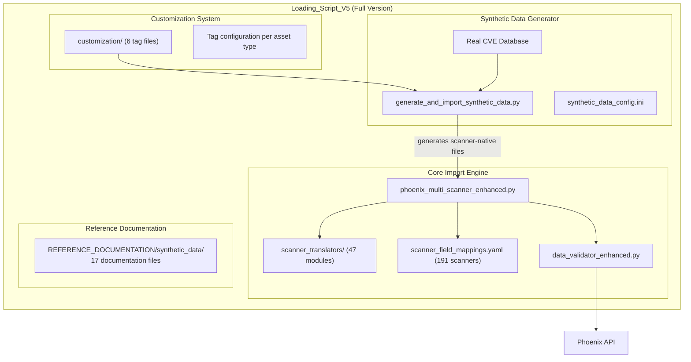
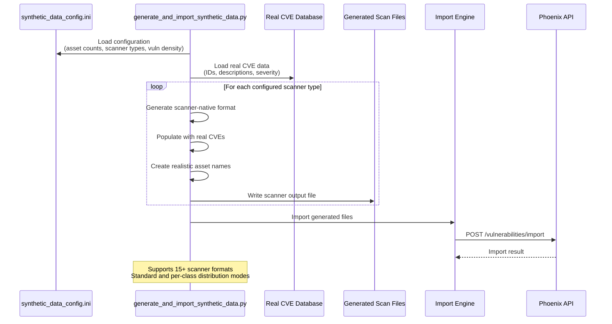

# Loading_Script_V5 — Architecture

**Version**: 5.0 (Full Version)
**Last Updated**: February 2026
**Path**: `Utils/Loading_Script_V5/`

---

## Table of Contents

- [Overview](#overview)
- [Private vs published layout](#private-vs-published-layout)
- [Component Diagram](#component-diagram)
- [Synthetic Data Generator Architecture](#synthetic-data-generator-architecture)
- [Related Documents](#related-documents)

---

## Overview

Loading_Script_V5 is the **canonical private-repo** multi-scanner import tool: core import engine, scanner service/client, synthetic data generator, and customization tooling live in this single folder.

---

## Private vs published layout

| Feature | Published copy (`Loading_Script_V5_PUB` in public repo) | This folder (private repo) |
|---------|--------------------------------------------------------|----------------------------|
| Scanner import (205+ scanners) | Yes | Yes |
| Scanner service (Docker) | Yes | Yes |
| Synthetic data generator | No | **Yes** |
| Tag customization system | No | **Yes** |
| AutoGroup pipeline integration | No | **Yes** |
| Reference documentation (synthetic data) | No | **Yes** |

The public copy is produced by `Utils/publish_utils_to_public_repo.py` (sanitized export). Core import architecture (translators, validation, batching, API interaction) is documented in the sections below.

---

## Component Diagram

---

## Synthetic Data Generator Architecture

### Key Components

| Component | File | Purpose |
|-----------|------|---------|
| Generator script | `synthetic-data-generator/generate_and_import_synthetic_data.py` | Main orchestrator (1,200 lines) |
| Generator config | `synthetic-data-generator/synthetic_data_config.ini` | Asset/vuln distribution settings (350 lines) |
| Tag configs | `customization/*.yaml` | Production tag templates per asset type |
| Test configs | `synthetic-data-generator/test_configs/` | Pre-built test configurations |

### Customization Features

1. **Per-scanner vulnerability counts**: Control min/max vulnerabilities per asset for each scanner
2. **Per-class asset distribution**: Specify exact counts for INFRA, CONTAINER, CLOUD, WEB, CODE
3. **Tag customization**: Define tags per asset type using production tag configuration files
4. **Real CVE data**: Uses actual NVD CVE entries for realistic demonstrations

---

## Related Documents

- Synthetic Data Guide — Usage guide
- REFERENCE_DOCUMENTATION/synthetic_data/ — Detailed synthetic data docs
- Utils Master Index
