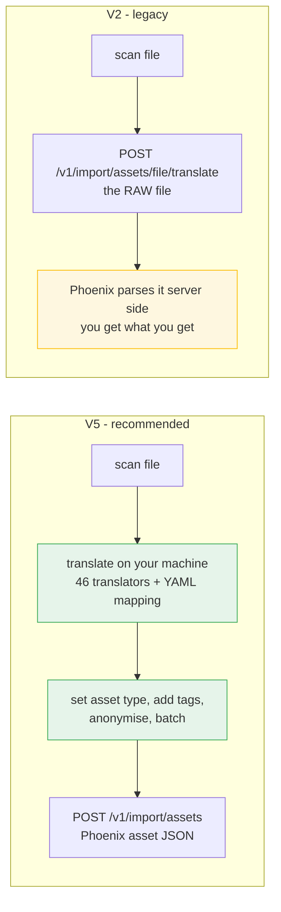
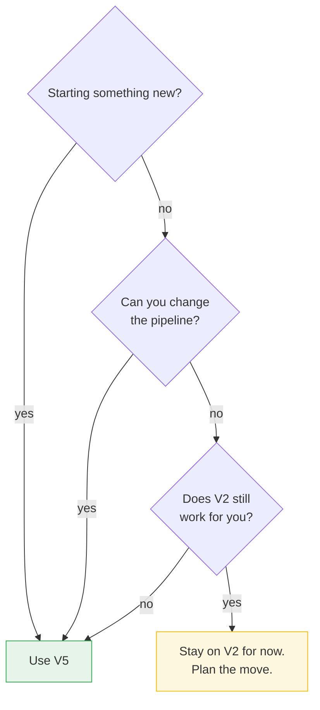

# Phoenix Security — Loading Scripts

Import vulnerability scanner results into [Phoenix Security](https://phoenix.security).

![Phoenix Security Loading Scripts. Scanners such as Trivy, Snyk, containers, IaC, secrets, Dependabot, AWS and SBOM produce JSON, SARIF, XML, CSV and SBOM files. The loading script ingests them, runs scanner detection and a modular translator, validates and batches, adds CI metadata, then uploads to the Phoenix platform, which emerges unified findings with asset, repository, application, environment, severity, scanner and CI metadata context. The pipeline reads scan, load, translate, normalize, enrich, Phoenix.](artefacts/loading-script-overview.jpeg)

**Your scanners. One pipeline. One Phoenix.**

This repository is the **public mirror**. It is generated from an internal repository by a
sanitizing publish tool. Do not edit files here by hand — see [Contributing](#contributing).

## What is in here

| Bundle | Version | Status | Use it for |
|---|---|---|---|
| [`Loading_Script_V5_PUB/`](Loading_Script_V5_PUB/) | [](Loading_Script_V5_PUB/CHANGELOG.md) | **Active** | Everything new. 205 scanner types, modular translators, batching, CI metadata tagging. |
| [`LEGACY_Loading_Script_V2_PUB/`](LEGACY_Loading_Script_V2_PUB/) | [](LEGACY_Loading_Script_V2_PUB/CHANGELOG.md) | Maintenance only | Older pipelines that already pin these scripts. |

**Start with V5.** V2 gets security and compatibility fixes only.

## The two methods, in one picture

The difference is *where the scanner file gets translated*.



V5 translates locally, so you can see and change what is sent. V2 hands the raw file to
the server, so you cannot.

| | V5 | V2 |
|---|---|---|
| Scanner types | 200+ | about 7 |
| Scanner detection | `--scanner auto` | you name it by hand |
| Credentials | `config.ini` or environment variables | **constants in the source file** |
| Field mapping | yours to change | fixed, server side |
| Asset type | 7 types, your choice | not controllable |
| CI metadata tags | `--tag-file` | none |
| Batching and retries | yes | none |
| Anonymisation | `--anonymize` | none |
| Verification | `--verify-import` | none |
| Error report | `--error-log` JSON | none |

Full detail and more diagrams:
[V5 how it works](Loading_Script_V5_PUB/README.md#how-it-works) ·
[V2 how it works and why it is not recommended](LEGACY_Loading_Script_V2_PUB/README.md#how-it-works)

## Which one do I use?



## Quick start (V5)

```bash
cd Loading_Script_V5_PUB
pip install -r requirements.txt

# 1. Create your config from the template. Never commit the result.
cp config_multi_scanner.ini.TEMPLATE config_multi_scanner.ini
$EDITOR config_multi_scanner.ini      # fill in client_id, client_secret, api_base_url

# 2. Import a scan file
python3 phoenix_multi_scanner_import.py \
  --config config_multi_scanner.ini \
  --scanner trivy \
  --file path/to/scan.json
```

More: [`Loading_Script_V5_PUB/START_HERE.md`](Loading_Script_V5_PUB/START_HERE.md) ·
[`README.md`](Loading_Script_V5_PUB/README.md) ·
[`QUICK_START_ALL_SCANNERS.md`](Loading_Script_V5_PUB/QUICK_START_ALL_SCANNERS.md)

## Credentials

Never commit credentials.

- Copy the `*.TEMPLATE` / `*.example` file, then fill in your own values.
- `config.ini`, `config_multi_scanner.ini`, `.env` and `*.pem` are all git-ignored.
- Any credential you see in this repository is `{REDACTED}` — the publish tool strips them.
  If you find a real one, please open an issue and we will rotate it.

## Versioning and releases

Each bundle carries its own [SemVer](https://semver.org/) version in a `VERSION` file, and
its own `CHANGELOG.md`. Releases are git tags on this repository:

| Bundle | Tag format | Latest |
|---|---|---|
| `Loading_Script_V5_PUB` | `loading-v5-v<VERSION>` | `loading-v5-v5.0.0` |
| `LEGACY_Loading_Script_V2_PUB` | `loading-v2-v<VERSION>` | `loading-v2-v2.0.0` |

To pin a version in a pipeline, check out the tag:

```bash
git clone --depth 1 --branch loading-v5-v5.0.0 https://github.com/securityphoenix/Loading-Script.git
```

The repository-level release log is [`CHANGELOG.md`](CHANGELOG.md).

> **Note on the V5 version number.** V5 previously used a `3.x` series. `5.0.0` realigns the
> number with the folder name. It is a numbering change only — `5.0.0` behaves exactly like
> the previous `3.4.0`. See [`Loading_Script_V5_PUB/CHANGELOG.md`](Loading_Script_V5_PUB/CHANGELOG.md).

## Contributing

Changes are made in the internal repository and published here by a tool that:

1. copies only the allow-listed bundles;
2. applies a per-bundle `.publishignore` deny list (runtime logs, uploads, test data,
   client data, credentials);
3. rewrites local paths, emails and credential assignments;
4. refuses to publish unless `VERSION` was bumped and `CHANGELOG.md` has a matching entry.

Please open an **issue** rather than a pull request. A pull request against this mirror is
overwritten by the next publish.

## Support

- Issues: <https://github.com/securityphoenix/Loading-Script/issues>
- Docs: <https://phoenix.security>

## Licence

See [`LICENCE`](LICENCE) if present, otherwise contact Phoenix Security.
